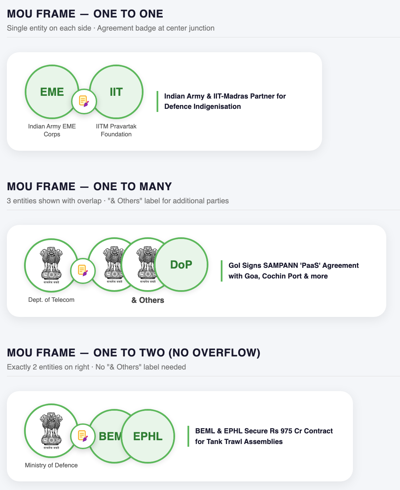

# MOU & Partnerships

### ASCII Layout

```
+---------------------------------------------------------------------------+
|  Note: 25 mm First Page of the Chapter, Subsequent Page - 15mm            |
|---------------------------------------------------------------------------|
|                                                                           |
|                          MoUs & Partnerships                              |
|                                                                           |
|---------------------------------------------------------------------------|
|                               |                                           |
| [Logo-1]X-iconX[Logo-2]       | [ NEWS HEADLINE - BOLD ]                  |
|                               | • Content Placeholder Detail Line         |
|                               | • Content Placeholder Detail Line         |
|                               |                                           |
|-------------------------------|                                           |
|                               |                                           |
| [Logo-1]X-iconX[Logo-2]       | [ NEWS HEADLINE - BOLD ]                  |
|                               | • Content Placeholder Detail Line         |
|                               | • Content Placeholder Detail Line         |
|                               |                                           |
|-------------------------------|                                           |
|                               |                                           |
| [Logo-1]X-iconX[Logo-2]       | [ NEWS HEADLINE - BOLD ]                  |
|                               | • Content Placeholder Detail Line         |
|                               | • Content Placeholder Detail Line         |
|                               |                                           |
|-------------------------------|                                           |
|                               |                                           |
| [Logo-1]X-iconX[Logo-2]       | [ NEWS HEADLINE - BOLD ]                  |
|                               | • Content Placeholder Detail Line         |
|                               | • Content Placeholder Detail Line         |
|                               |                                           |
|---------------------------------------------------------------------------|
|                        Footer Height = 15mm                               |
+---------------------------------------------------------------------------+
```

### ASCII Layout <a href="#ascii-layout" id="ascii-layout"></a>

```
┌──────────────────────────────────────────────────────────────────┐
│  CHAPTER BANNER: MOUs & AGREEMENTS                               │
└──────────────────────────────────────────────────────────────────┘

┌──────────────────────┬──────────────────────────┬────────────────────────────────┐
│                      │                          │                                │
│  [ENTITY 1 LOGO]     │  [ENTITY 2 LOGO]         │  **News Headline**             │
│                      │                          │  <ul><li>content...</li></ul>  │
│  Primary / First     │  Secondary entity logo   │                                │
│  entity encountered  │  (comma separated if     │  OR paragraph style            │
│                      │   more than one)         │  as per source                 │
│                      │                          │                                │
├──────────────────────┼──────────────────────────┼────────────────────────────────┤
│  [ENTITY 1 LOGO]     │  [E2 LOGO] , [E3 LOGO]   │  **Next Headline**             │
│                      │  [E4 LOGO]               │  content...                    │
└──────────────────────┴──────────────────────────┴────────────────────────────────┘

        Col 1                   Col 2                      Col 3
  (primary entity logo)   (other entity logos)          (full content)
      ~18% width               ~22% width                 ~60% width
```

**Multi-entity logo pattern in Col 2:**

```
2 entities total   →  Col1: [E1]          Col2: [E2]
3 entities total   →  Col1: [E1]          Col2: [E2] , [E3]
4 entities total   →  Col1: [E1]          Col2: [E2] , [E3] , [E4]
```

***

### Structuring Prompt <a href="#structuring-prompt" id="structuring-prompt"></a>

<pre><code>## SYSTEM:
You are a precise document transformation assistant for a monthly current affairs
magazine. You restructure MOU, agreement, partnership, LOI, LOA, and cooperation
deal news articles into a strict markdown table format for PDF generation via
WeasyPrint. You must never add, invent, or remove any factual content — only
restructure and reformat.

---

<strong>## USER:
</strong>
Transform the following MOUs &#x26; AGREEMENTS chapter markdown document into the
structured format described below.

---

### TARGET FORMAT

The output must be a single markdown document with one table:

# MOUs &#x26; AGREEMENTS

| Entity 1 | Other Entities | Description |
|----------|----------------|-------------|
|  |  | **Full Headline**[news content] |

---

### STEP 1 — IDENTIFY &#x26; CLASSIFY ENTITIES (Do this before building the table)

For every news item, identify all entities involved in the MOU, agreement, LOI,
LOA, partnership, or cooperation deal.

**Rules for entity identification:**
- An entity can be: a government ministry, a company, a university, an international
  organisation, a nation, a public sector undertaking, a startup, a research body,
  or any named organisation entering into the agreement.
- Read the full news content carefully. Entities are usually identified by phrases
  like "signed an MOU with", "entered into an agreement with", "partnered with",
  "inked a deal with", "collaboration between X and Y", "memorandum signed by".
- Extract the FULL official name of each entity as stated in the source.
- Assign a logo key for each entity: lowercase, no spaces, no special characters,
  no punctuation. Examples:
  - "Indian Space Research Organisation" → logo_isro
  - "Ministry of Education" → logo_ministryofeducation
  - "Tata Consultancy Services" → logo_tcs
  - "University of Delhi" → logo_universityofdelhi
  - "Government of India" → logo_governmentofindia
  - "Amazon Web Services" → logo_amazonwebservices

**Primary entity (Column 1):**
- The FIRST entity encountered in the news headline or opening sentence is the
  primary entity and goes in Column 1.
- If two entities are mentioned simultaneously with no clear ordering, use the
  Indian/domestic entity as primary. If both are foreign or both are domestic,
  use the one mentioned first in the headline.

**Other entities (Column 2):**
- All remaining entities beyond the first go in Column 2.
- If there is only one other entity: place its logo token directly.
- If there are multiple other entities: place all their logo tokens separated by
  a space-comma-space ( , ) within the same cell, wrapping to a new &#x3C;br> line
  after every 2 logos for readability.

---

### COLUMN-BY-COLUMN RULES

**Column 1 — Primary Entity Logo:**
- Use the logo token format: 
- One token only — the primary entity identified in Step 1.
- This is a keyed placeholder (not sequential) — your rendering application will
  resolve this key to the correct logo asset.

**Column 2 — Other Entity Logos:**
- Use the same logo token format: 
- List all remaining entity logo tokens separated by  ,  (space-comma-space).
- If more than 2 other entities, wrap after every 2 using &#x3C;br> for layout hygiene.
- If there is only one other entity, place its single token with no separator.

**Column 3 — Description:**
- Begin with the full news headline in bold: **Headline Text**
- STRICT REQUIREMENT: After the closing ** of the headline, do NOT insert any
  &#x3C;br> or double &#x3C;br> before the content. Immediately follow with the content in
  its natural form — either a &#x3C;ul> list or a plain paragraph — with zero blank
  line separation from the headline. Violation of this rule will cause the output
  to be rejected.
  Correct:   **Headline Text**&#x3C;ul>&#x3C;li>first point&#x3C;/li>&#x3C;/ul>
  Correct:   **Headline Text** Organization X signed an MOU with Organization Y...
  Incorrect: **Headline Text**&#x3C;br>&#x3C;br>content
  Incorrect: **Headline Text**&#x3C;br>content
- Include ALL content from the original news item fully — do not summarize or
  truncate.
- Preserve all inline markdown: **bold**, *italic*.
- Convert unordered lists to: &#x3C;ul>&#x3C;li>item&#x3C;/li>&#x3C;li>item&#x3C;/li>&#x3C;/ul>
- Convert ordered lists to: &#x3C;ol>&#x3C;li>item&#x3C;/li>&#x3C;li>item&#x3C;/li>&#x3C;/ol>
- Nested lists should use nested &#x3C;ul>/&#x3C;ol> tags accordingly.
- Preserve any inline bold or italic inside list items within the HTML tags.
- Preserve all section sub-headings from the original (e.g., "Key Objectives:",
  "Agreement Highlights:", "Scope of Collaboration:") as **Sub-heading:** value
  inline in the description.
- Fields like "Duration:", "Signed By:", "Witnessed By:", "Effective Date:",
  "Key Areas:" must be preserved as **Field Name:** value inline.
- If the news content contains tabular data (e.g., a structured list of
  collaboration areas with departments mapped to each), do NOT embed it inside
  the description cell. Instead, close the current news table row normally,
  place the accompanying table as a standalone markdown table immediately after,
  then restart a new | Entity 1 | Other Entities | Description | table with
  fresh headers to continue the next news item.
- Escape any pipe characters inside cells as \|.
- Use &#x3C;br> for paragraph breaks within the cell — never raw newlines.

**Date information:**
- Dates (## DD-MM-YY) from the original document must not appear anywhere in
  the output.
- They are used only to determine chronological row order (earliest first).
- No date headings, no date dividers, no date column anywhere in the output.

**Row ordering:**
- Rows must appear in the same chronological order as the input
  (earliest ## DD-MM-YY date first, within a date in original top-to-bottom order).

**Formatting hygiene:**
- Escape any pipe characters | inside table cells as \|.
- Use &#x3C;br> for all line breaks inside cells — never raw newlines.
- Do not add any commentary, preamble, or explanation outside the markdown.
- The output must begin with # MOUs &#x26; AGREEMENTS and then the table. Nothing else.

---

## INPUT DOCUMENT:

```markdown
[PASTE RAW MARKDOWN CHAPTER HERE]
```
</code></pre>

***

### Illustrative Transform Example <a href="#illustrative-transform-example" id="illustrative-transform-example"></a>

For a news item: _"ISRO and NASA sign an MOU for joint lunar exploration. Key areas include data sharing, crew training, and satellite coordination."_

```
text# MOUs & AGREEMENTS

| Entity 1 | Other Entities | Description |
|----------|----------------|-------------|
|  |  | **ISRO and NASA Sign MOU for Joint Lunar Exploration**<ul><li>ISRO and NASA have formally signed a Memorandum of Understanding for joint lunar exploration activities.</li><li>**Key Areas:** Data sharing, crew training, and satellite coordination.</li></ul> |
```

For a 3-entity deal: _"Ministry of Education, IIT Delhi, and Infosys sign tripartite MOU for skilling."_

```
text|  |  ,  | **Ministry of Education, IIT Delhi and Infosys Sign Tripartite MOU for Skilling**<ul><li>content...</li></ul> |
```

***

## Image Handling

### File: `logos.json` <a href="#file-logosjson" id="file-logosjson"></a>

```
json{
  "registry": {
    "government_ministries": {
      "logo_isro": {
        "name": "Indian Space Research Organisation",
        "logo_url": "https://upload.wikimedia.org/wikipedia/commons/thumb/b/b9/ISRO_Logo.svg/240px-ISRO_Logo.svg.png"
      },
      "logo_ministryofeducation": {
        "name": "Ministry of Education",
        "logo_url": "https://..."
      },
      "logo_governmentofindia": {
        "name": "Government of India",
        "logo_url": "https://..."
      }
    },
    "international_bodies": {
      "logo_nasa": {
        "name": "NASA",
        "logo_url": "https://upload.wikimedia.org/wikipedia/commons/thumb/e/e5/NASA_logo.svg/320px-NASA_logo.svg.png"
      },
      "logo_who": {
        "name": "World Health Organisation",
        "logo_url": "https://..."
      },
      "logo_imf": {
        "name": "International Monetary Fund",
        "logo_url": "https://..."
      },
      "logo_worldbank": {
        "name": "World Bank",
        "logo_url": "https://..."
      }
    },
    "public_sector": {
      "logo_ongc": {
        "name": "Oil and Natural Gas Corporation",
        "logo_url": "https://..."
      },
      "logo_ntpc": {
        "name": "NTPC Limited",
        "logo_url": "https://..."
      }
    },
    "private_sector": {
      "logo_tcs": {
        "name": "Tata Consultancy Services",
        "logo_url": "https://..."
      },
      "logo_infosys": {
        "name": "Infosys",
        "logo_url": "https://..."
      },
      "logo_amazonwebservices": {
        "name": "Amazon Web Services",
        "logo_url": "https://..."
      }
    },
    "universities_research": {
      "logo_iitdelhi": {
        "name": "IIT Delhi",
        "logo_url": "https://..."
      },
      "logo_universityofdelhi": {
        "name": "University of Delhi",
        "logo_url": "https://..."
      }
    },
    "sports_bodies": {
      "logo_bcci": {
        "name": "Board of Control for Cricket in India",
        "logo_url": "https://..."
      },
      "logo_hockeyindia": {
        "name": "Hockey India",
        "logo_url": "https://..."
      }
    },
    "sports_icons": {
      "logo_cricket": {
        "name": "Cricket",
        "logo_url": "https://..."
      },
      "logo_badminton": {
        "name": "Badminton",
        "logo_url": "https://..."
      },
      "logo_tennis": {
        "name": "Tennis",
        "logo_url": "https://..."
      },
      "logo_generalsports": {
        "name": "General Sports",
        "logo_url": "https://..."
      }
    },
    "fallback": {
      "logo_unknown": {
        "name": "Unknown Entity",
        "logo_url": "https://via.placeholder.com/80x80?text=?"
      }
    }
  }
}
```

***

### FastAPI Integration <a href="#fastapi-integration" id="fastapi-integration"></a>

The flat lookup is all your parser needs — categories exist only for human readability in the editor. FastAPI flattens on load:

```
pythonimport json

def load_logo_registry(path: str = "logos.json") -> dict:
    with open(path) as f:
        data = json.load(f)
    # Flatten all categories into single dict for O(1) lookup
    flat = {}
    for category in data["registry"].values():
        flat.update(category)
    return flat  
    # Result: { "logo_isro": { "name": ..., "logo_url": ... }, ... }

logo_registry = load_logo_registry()

def resolve_logo_tokens(html: str, registry: dict) -> str:
    import re
    def replacer(match):
        key = match.group(1)
        entry = registry.get(key, registry["logo_unknown"])
        url = entry["logo_url"]
        name = entry["name"]
        return f''
    # Matches:   after markdown→HTML conversion
    return re.sub(r']+alt="entity"[^>]+src="(logo_[^"]+)"[^>]*/?>', replacer, html)
```

***

### Adding a New Entry <a href="#adding-a-new-entry" id="adding-a-new-entry"></a>

When a new organisation appears in monthly content, the editor simply appends one object to the relevant category — no schema change, no code change needed:

```
json"logo_iitbombay": {
  "name": "IIT Bombay",
  "logo_url": "https://upload.wikimedia.org/wikipedia/en/thumb/1/1d/IIT_Bombay_Logo.svg/240px-IIT_Bombay_Logo.svg.png"
}
```

***

### MOU Logo Placement for WeasyPrint PDF <a href="#layout-prompt-mou-logo-placement-for-weasyprint-pd" id="layout-prompt-mou-logo-placement-for-weasyprint-pd"></a>

<figure><figcaption></figcaption></figure>

### Visual Structure Analysis (from attached image) <a href="#visual-structure-analysis-from-attached-image" id="visual-structure-analysis-from-attached-image"></a>

The image shows two layout variants:

* **Top row (1-to-1 MOU):** Two equal-sized circular logo frames placed side by side, slightly overlapping at the center. A MOU/agreement icon (document + pen) floats centered on top, overlapping both circles at the junction — acting as a visual "connector" between the two parties.
* **Bottom row (1-to-many MOU):** One circle on the left (Entity 1), followed by 2–3 overlapping circles on the right (Other Entities), each shifted so the center of the next circle aligns with the circumference of the previous one (50% overlap). A bold `& Others` subtitle sits beneath the right-side cluster.

***

### WeasyPrint HTML/CSS Prompt <a href="#weasyprint-htmlcss-prompt" id="weasyprint-htmlcss-prompt"></a>

```
textDesign a WeasyPrint-compatible HTML+CSS layout for rendering MOU agreement logo pairs in a PDF.

LAYOUT RULES:

1. CONTAINER:
   - Each MOU row is a flex row: display: flex; align-items: center; gap: 24px;
   - Left side: Entity 1 logo circle (fixed size).
   - Center: MOU icon badge floating between both sides.
   - Right side: Entity 2 logo circle(s), arranged as an overlapping cluster.

2. LOGO CIRCLE FRAME:
   - Each logo is wrapped in a circular frame: width: 80px; height: 80px;
   - Border: 2.5px solid #4CAF50 (green).
   - border-radius: 50%;
   - overflow: hidden;
   - background: white;
   - The logo image inside: width: 100%; height: 100%; object-fit: contain; padding: 6px;

3. CENTER MOU BADGE (Agreement Icon):
   - Position: absolute; centered horizontally between Entity 1 and Entity 2 cluster.
   - z-index: 10 (top layer, renders above both circle frames).
   - Icon size: 36px × 36px.
   - Use an SVG agreement/handshake/document icon or an image from logos.json's fallback.
   - Background: white circle with subtle drop shadow.
   - border-radius: 50%; padding: 4px; box-shadow: 0 2px 6px rgba(0,0,0,0.2);

4. SINGLE ENTITY 2 (1-to-1 MOU):
   - One circle frame. Slightly overlaps Entity 1 circle (margin-left: -12px).
   - Both circles equal in size.
   - MOU badge centered between them at their junction.

5. MULTIPLE ENTITIES (1-to-many MOU, up to 2 logos shown):
   - Render max 2 logos from Other Entities column.
   - Each subsequent circle overlaps the previous by 50% of circle diameter:
     margin-left: -40px; (for 80px circles)
   - This creates the "half-center-on-circumference" overlap effect.
   - If more than 3 entities exist, show only 3 circles and add:
     <div class="others-label">& Others</div>
     Styled as: font-weight: bold; font-size: 11px; color: #333; margin-top: 4px; text-align: center;

6. CLUSTER WRAPPER (right side for multi-entity):
   - display: flex; flex-direction: column; align-items: center;
   - Inner circle row: display: flex; flex-direction: row; align-items: center;
   - Each circle after the first: position: relative; margin-left: -40px; z-index increments by 1 per circle.
   - First circle z-index: 1, second: 2, third: 3 (so front circles render on top).

7. FALLBACK:
   - If logo_url is "https://..." placeholder or missing, show entity initials in a
     colored circle (background: #E8F5E9; color: #2E7D32; font-weight: bold; font-size: 14px).

8. WEASYPRINT SPECIFICS:
   - Avoid CSS position: absolute for the MOU badge in WeasyPrint — use a flex column
     wrapper with negative margin-top to simulate overlay:
     .mou-badge { margin-left: -16px; margin-right: -16px; z-index: 10; align-self: center; }
   - Use @page { margin: 20mm; } for PDF page setup.
   - All font sizes in pt units for reliable PDF rendering.
   - Use inline SVG for the MOU agreement icon to avoid external resource loading issues.
```

***

### Jinja2 Template Logic (for WeasyPrint) <a href="#jinja2-template-logic-for-weasyprint" id="jinja2-template-logic-for-weasyprint"></a>

```
text
<div class="mou-row">

  {# Entity 1 - always single #}
  <div class="entity-circle">
    
  </div>

  {# Center MOU Badge #}
  <div class="mou-badge">
    <!-- inline SVG: agreement document icon -->
  </div>

  {# Entity 2 side - single or cluster #}
  <div class="entity-cluster">
    
    
    <div class="entity-circle overlap-{{ loop.index }}">
      
    </div>
    
    
    <div class="others-label">& Others</div>
    
  </div>

</div>

```

***

### Key CSS Values Summary <a href="#key-css-values-summary" id="key-css-values-summary"></a>

| Property               | Value                 | Purpose                               |
| ---------------------- | --------------------- | ------------------------------------- |
| Circle size            | `80px × 80px`         | Logo frame diameter                   |
| Circle overlap (multi) | `margin-left: -40px`  | 50% overlap (center-on-circumference) |
| Circle border          | `2.5px solid #4CAF50` | Green ring frame                      |
| MOU badge size         | `36px × 36px`         | Center agreement icon                 |
| Badge z-index          | `10`                  | Floats above both circles             |
| Entity 1 ↔ 2 gap       | `margin-left: -12px`  | Slight touch overlap for 1-to-1       |
| `& Others` font        | `bold 11px #333`      | Subtitle below cluster                |

This structure mirrors the overlapping circular frame pattern shown in your reference image exactly, and is WeasyPrint-safe by avoiding `position: absolute` in favour of negative margins and flex z-ordering.

### Code Example

```
<!DOCTYPE html>
<html lang="en">
<head>
  <meta charset="UTF-8">
  <meta name="viewport" content="width=device-width, initial-scale=1.0">
  <title>MOU Logo Frame Demo</title>
  <style>
    * { box-sizing: border-box; margin: 0; padding: 0; }

    body {
      font-family: 'Segoe UI', sans-serif;
      background: #f4f6f9;
      padding: 40px;
      color: #333;
    }

    h2 {
      font-size: 13pt;
      font-weight: 700;
      color: #1a1a2e;
      margin-bottom: 6px;
      text-transform: uppercase;
      letter-spacing: 0.5px;
    }

    .section-label {
      font-size: 9pt;
      color: #777;
      margin-bottom: 24px;
      border-bottom: 1px solid #ddd;
      padding-bottom: 8px;
    }

    .demo-section {
      margin-bottom: 48px;
    }

    /* ─── MOU ROW ─────────────────────────────────── */
    .mou-row {
      display: inline-flex;
      align-items: center;
      background: white;
      border-radius: 20px;
      padding: 20px 28px;
      box-shadow: 0 4px 18px rgba(0,0,0,0.08);
      position: relative;
      gap: 0;
    }

    /* ─── CIRCLE FRAME ────────────────────────────── */
    .entity-circle {
      width: 88px;
      height: 88px;
      border-radius: 50%;
      border: 3px solid #5db85c;
      background: white;
      overflow: hidden;
      display: flex;
      align-items: center;
      justify-content: center;
      flex-shrink: 0;
      box-shadow: 0 2px 8px rgba(0,0,0,0.1);
      position: relative;
    }

    .entity-circle img {
      width: 72%;
      height: 72%;
      object-fit: contain;
    }

    /* Fallback initials */
    .entity-circle .initials {
      font-size: 18px;
      font-weight: 700;
      color: #2e7d32;
      background: #e8f5e9;
      width: 100%;
      height: 100%;
      display: flex;
      align-items: center;
      justify-content: center;
      border-radius: 50%;
    }

    /* ─── MOU BADGE (center icon) ─────────────────── */
    .mou-badge-wrapper {
      display: flex;
      flex-direction: column;
      align-items: center;
      position: relative;
      z-index: 10;
      margin: 0 -14px;
    }

    .mou-badge {
      width: 42px;
      height: 42px;
      background: white;
      border-radius: 50%;
      border: 2.5px solid #5db85c;
      box-shadow: 0 3px 10px rgba(0,0,0,0.18);
      display: flex;
      align-items: center;
      justify-content: center;
      z-index: 10;
    }

    .mou-badge svg {
      width: 22px;
      height: 22px;
    }

    /* ─── ENTITY CLUSTER (right side, multi) ─────── */
    .entity-cluster {
      display: flex;
      flex-direction: column;
      align-items: flex-start;
    }

    .cluster-circles {
      display: flex;
      flex-direction: row;
      align-items: center;
    }

    .cluster-circles .entity-circle:not(:first-child) {
      margin-left: -34px;
    }

    .cluster-circles .entity-circle:nth-child(1) { z-index: 1; }
    .cluster-circles .entity-circle:nth-child(2) { z-index: 2; }
    .cluster-circles .entity-circle:nth-child(3) { z-index: 3; }

    .others-label {
      font-size: 9.5pt;
      font-weight: 700;
      color: #444;
      margin-top: 6px;
      text-align: center;
      width: 100%;
    }

    /* ─── ENTITY NAME TAG ─────────────────────────── */
    .entity-name {
      font-size: 7.5pt;
      color: #555;
      text-align: center;
      margin-top: 5px;
      max-width: 90px;
      line-height: 1.3;
    }

    .entity-wrap {
      display: flex;
      flex-direction: column;
      align-items: center;
    }

    /* ─── MOU TITLE ───────────────────────────────── */
    .mou-title {
      font-size: 8.5pt;
      font-weight: 600;
      color: #1a1a2e;
      margin-left: 20px;
      max-width: 240px;
      line-height: 1.5;
      border-left: 3px solid #5db85c;
      padding-left: 10px;
    }
  </style>
</head>
<body>

  <!-- ══════════════════════════════════════════════ -->
  <!--  SECTION 1: ONE-TO-ONE                        -->
  <!-- ══════════════════════════════════════════════ -->
  <div class="demo-section">
    <h2>MOU Frame — One to One</h2>
    <div class="section-label">Single entity on each side · Agreement badge at center junction</div>

    <div class="mou-row">
      <!-- Entity 1 -->
      <div class="entity-wrap">
        <div class="entity-circle">
          
          <div class="initials" style="display:none">EME</div>
        </div>
        <div class="entity-name">Indian Army EME Corps</div>
      </div>

      <!-- Center MOU Badge -->
      <div class="mou-badge-wrapper">
        <div class="mou-badge">
          <!-- MOU Document SVG Icon -->
          <svg viewBox="0 0 24 24" fill="none" xmlns="http://www.w3.org/2000/svg">
            <rect x="4" y="2" width="12" height="16" rx="2" fill="#fff9c4" stroke="#f9a825" stroke-width="1.5"/>
            <line x1="7" y1="7" x2="13" y2="7" stroke="#f9a825" stroke-width="1.2" stroke-linecap="round"/>
            <line x1="7" y1="10" x2="13" y2="10" stroke="#f9a825" stroke-width="1.2" stroke-linecap="round"/>
            <line x1="7" y1="13" x2="10" y2="13" stroke="#f9a825" stroke-width="1.2" stroke-linecap="round"/>
            <path d="M13 16 Q15 13 17 15 Q19 17 17 19 L12 21 L13 16Z" fill="#9c27b0" stroke="#7b1fa2" stroke-width="0.8"/>
            <line x1="17" y1="15" x2="20" y2="12" stroke="#7b1fa2" stroke-width="1.2" stroke-linecap="round"/>
            <rect x="19" y="10.5" width="2" height="3" rx="0.5" transform="rotate(45 19 10.5)" fill="#e91e63"/>
          </svg>
        </div>
      </div>

      <!-- Entity 2 -->
      <div class="entity-wrap">
        <div class="entity-circle">
          
          <div class="initials" style="display:none">IIT</div>
        </div>
        <div class="entity-name">IITM Pravartak Foundation</div>
      </div>

      <!-- Title -->
      <div class="mou-title">
        Indian Army & IIT-Madras Partner for Defence Indigenisation
      </div>
    </div>
  </div>


  <!-- ══════════════════════════════════════════════ -->
  <!--  SECTION 2: ONE-TO-MANY (3 entities + more)   -->
  <!-- ══════════════════════════════════════════════ -->
  <div class="demo-section">
    <h2>MOU Frame — One to Many</h2>
    <div class="section-label">3 entities shown with overlap · "& Others" label for additional parties</div>

    <div class="mou-row">
      <!-- Entity 1 -->
      <div class="entity-wrap">
        <div class="entity-circle">
          
          <div class="initials" style="display:none">DoT</div>
        </div>
        <div class="entity-name">Dept. of Telecom</div>
      </div>

      <!-- Center MOU Badge -->
      <div class="mou-badge-wrapper">
        <div class="mou-badge">
          <svg viewBox="0 0 24 24" fill="none" xmlns="http://www.w3.org/2000/svg">
            <rect x="4" y="2" width="12" height="16" rx="2" fill="#fff9c4" stroke="#f9a825" stroke-width="1.5"/>
            <line x1="7" y1="7" x2="13" y2="7" stroke="#f9a825" stroke-width="1.2" stroke-linecap="round"/>
            <line x1="7" y1="10" x2="13" y2="10" stroke="#f9a825" stroke-width="1.2" stroke-linecap="round"/>
            <line x1="7" y1="13" x2="10" y2="13" stroke="#f9a825" stroke-width="1.2" stroke-linecap="round"/>
            <path d="M13 16 Q15 13 17 15 Q19 17 17 19 L12 21 L13 16Z" fill="#9c27b0" stroke="#7b1fa2" stroke-width="0.8"/>
            <line x1="17" y1="15" x2="20" y2="12" stroke="#7b1fa2" stroke-width="1.2" stroke-linecap="round"/>
            <rect x="19" y="10.5" width="2" height="3" rx="0.5" transform="rotate(45 19 10.5)" fill="#e91e63"/>
          </svg>
        </div>
      </div>

      <!-- Entity Cluster (right side) -->
      <div class="entity-wrap">
        <div class="entity-cluster">
          <div class="cluster-circles">
            <!-- Circle 1 -->
            <div class="entity-circle">
              
              <div class="initials" style="display:none">GOA</div>
            </div>
            <!-- Circle 2 -->
            <div class="entity-circle">
              
              <div class="initials" style="display:none">CPA</div>
            </div>
            <!-- Circle 3 -->
            <div class="entity-circle">
              
              <div class="initials" style="display:none">DoP</div>
            </div>
          </div>
          <div class="others-label">& Others</div>
        </div>
      </div>

      <!-- Title -->
      <div class="mou-title">
        GoI Signs SAMPANN 'PaaS' Agreement with Goa, Cochin Port & more
      </div>
    </div>
  </div>


  <!-- ══════════════════════════════════════════════ -->
  <!--  SECTION 3: ONE-TO-MANY (exactly 2 entities)  -->
  <!-- ══════════════════════════════════════════════ -->
  <div class="demo-section">
    <h2>MOU Frame — One to Two (no overflow)</h2>
    <div class="section-label">Exactly 2 entities on right · No "& Others" label needed</div>

    <div class="mou-row">
      <!-- Entity 1 -->
      <div class="entity-wrap">
        <div class="entity-circle">
          
          <div class="initials" style="display:none">MoD</div>
        </div>
        <div class="entity-name">Ministry of Defence</div>
      </div>

      <!-- Center MOU Badge -->
      <div class="mou-badge-wrapper">
        <div class="mou-badge">
          <svg viewBox="0 0 24 24" fill="none" xmlns="http://www.w3.org/2000/svg">
            <rect x="4" y="2" width="12" height="16" rx="2" fill="#fff9c4" stroke="#f9a825" stroke-width="1.5"/>
            <line x1="7" y1="7" x2="13" y2="7" stroke="#f9a825" stroke-width="1.2" stroke-linecap="round"/>
            <line x1="7" y1="10" x2="13" y2="10" stroke="#f9a825" stroke-width="1.2" stroke-linecap="round"/>
            <line x1="7" y1="13" x2="10" y2="13" stroke="#f9a825" stroke-width="1.2" stroke-linecap="round"/>
            <path d="M13 16 Q15 13 17 15 Q19 17 17 19 L12 21 L13 16Z" fill="#9c27b0" stroke="#7b1fa2" stroke-width="0.8"/>
            <line x1="17" y1="15" x2="20" y2="12" stroke="#7b1fa2" stroke-width="1.2" stroke-linecap="round"/>
            <rect x="19" y="10.5" width="2" height="3" rx="0.5" transform="rotate(45 19 10.5)" fill="#e91e63"/>
          </svg>
        </div>
      </div>

      <!-- Entity Cluster (2 entities, no label) -->
      <div class="entity-wrap">
        <div class="entity-cluster">
          <div class="cluster-circles">
            <div class="entity-circle">
              
              <div class="initials" style="display:none">BEML</div>
            </div>
            <div class="entity-circle">
              <div class="initials">EPHL</div>
            </div>
          </div>
        </div>
      </div>

      <!-- Title -->
      <div class="mou-title">
        BEML & EPHL Secure Rs 975 Cr Contract for Tank Trawl Assemblies
      </div>
    </div>
  </div>

</body>
</html>
```
