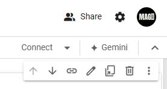
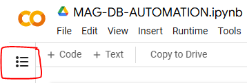
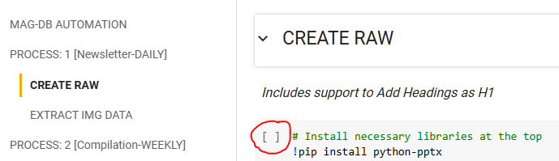
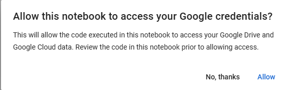
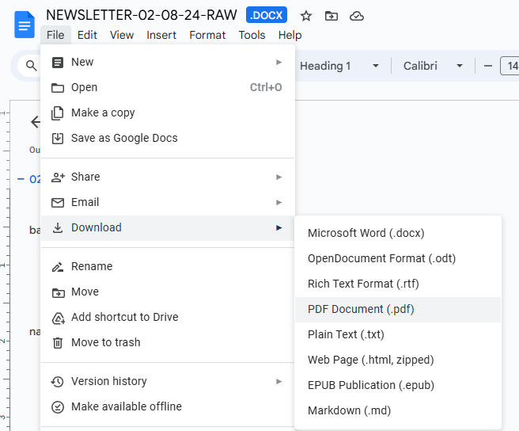

# RAW File \<Newsletter>

<figure><figcaption><p>Image: Diagram Process of Newsletter</p></figcaption></figure>

## STEP 1: File Arrives

### DISCORD:

A notification with <@username> will alert the designer upon file arrival in "#newsletter-daily" channel.

### GOOGLE DRIVE

1. Make a Copy of <.pptx> file from Shared Folder into "My Drive"
2. Rename this <.pptx> file in this format: DD-MM-YY.pptx (Ex: 01-01-24.pptx)

## STEP 2: File Conversion

### GOOGLE CODE COLABORATORY



Connect to the Server (Locate the Option on Top Right Corner)

<figure><figcaption><p>Connect with Cloud Server</p></figcaption></figure>

Open Table of Content (Locate on the Top Left Corner)

<figure><figcaption><p>Open Colab Index</p></figcaption></figure>

Go to CREATE RAW Under PROCESS 1 : \[Newsletter-Daily] and Run It

<figure><figcaption><p>Run the Cell</p></figcaption></figure>

Allow Access to Google Credentials and Google Drive

<figure><figcaption><p>Allow</p></figcaption></figure>

<figure><figcaption><p>Connect to Google Drive</p></figcaption></figure>

Enter the Exact <.pptx> filename into the Input Field

<figure><figcaption><p>Example Image: 02-08-24.pptx</p></figcaption></figure>

Go to EXTRACT IMG DATA Under PROCESS 1 : \[Newsletter-Daily] and Run It

<figure><figcaption><p>Run the Cell</p></figcaption></figure>

Enter the Exact <.pptx> filename into the Input Field

<figure><figcaption><p>Example Image: 02-08-24.pptx</p></figcaption></figure>

## STEP 3: File Processing

### GOOGLE DRIVE

* Select and Cut {Ctrl+X} all 3 Items (Img Folder + Newsletter + PPTX)
* Paste into this Location: My Drive / MAGDB / Month / Daily-Newsletter

### GOOGLE DOCS

Open the Newsletter Docs file for formatting as Instructed below in video:

#### WATCH VIDEO GUIDE




Properly Identify Headings using pptx file as reference.

Remove Non-Heading type Content and make them as "Normal-Text" instead.

CHECK: Dual Tables on Single Slides, Fix them.

Remove repetitive occurrence of the word: "NEWSLIDE" using CTRL + H.


### MCQ Table /w AI

#### METHOD 1:

Using the URL to Google Colaboratory, In Process 1 of \[NEWSLETTER-DAILY], Go to **"GENERATE QA /W AI"** and enter the full name of Newsletter Document ex: 'NEWSLETTER-DD-MM-YY-RAW.docx', the API will process the document and 4 responses will be presented, then Manually Read all 4 Responses one by one and choose only the best table with a good level of Questions-Answers.


GO TO COLAB CODE



VIDEO DEMO


#### METHOD 2:

After the Docs file is edited as instructed above, we'll save the file as Markdown (.md)

<figure><figcaption><p>Save the File as PDF</p></figcaption></figure>


Example Response


Create a new thread/conversation by clicking on the + icon then in the chat tap on the paperclip icon to attach the makrdown file to Perplexity AI and Give this Prompt to find Top 5 MCQs then Copy the Output of Generated table and paste it into Newsletter-Docs-File.

```
What to Do?

Read the attached current affairs markdown document to generate question-answers table.

Guidance:

- Background: Attached Document is a Newsletter which contains current affairs news related to latest events covering many news categories. The Newsletter is read by Students preparing for competitive examinations and this Questionnaire is a part of their preparation to assess themselves on the understanding of the newsletter read by them.
- Questionnaire-Level: The students expect the question statements to be challenging enough to test thorough reading of the newsletter. Questions should be precise but not easily answerable without careful study of the content.
- NOTE:
    1. Questions must be one single sentence only. Answers should be articulate, on point, and directly supported by information in the newsletter.
    2. Ensure questions cover different topics/sections from the newsletter for comprehensive assessment.
- STRICTLY: Avoid lengthy questions or explanatory answers. Always remember the above mentioned NOTE when framing Question-Answers from the document.

Inspirational-Question-framing-style-examples:

- Who….?
- When…?
- What…?
- Which…?
- Where….?
- According to ….., (Who/what/when/which/where)………?
- Under which (Section/Regulation/Act)…….,(Who/what/when/which/where)……?
- Which (initiative/program/policy) was launched to address...?

Output Structure:

Tabular representation with 6 rows and 2 columns:

- Header row: 'Q' in first column and 'A' in second column
- Following 5 Rows: Each row contains a Question in the first column and its corresponding Answer in the second column.
```

### NOTION

Update the **STATUS** to: "In-Progress"

Paste the Link to docs file in **INPUT-RAW-URL**

## STEP 4: File Designing

Watch this video to understand the complete design process:



### CANVA

* Open the associated Design File of Newsletter.
* Use the Newsletter Docs File to update the Design file to Latest Content.
* Insert Images into Design File using the Drive Folder containing the extracted Images.
* Insert Hyperlinks of the associated Newsletter LIVE Sessions.

#### YOUTUBE

* Open the Channel ([https://www.youtube.com/@StudyYRKapilKathpal/streams](https://www.youtube.com/@StudyYRKapilKathpal/streams)) and Find associated LIVE Stream URL.
* If URL is not found, the default link to channel must be preserved.

## STEP 5: File Cross-Checking

* Check Consistency of Newsletter Content in the final design using the Raw Newsletter Docs File in Split Screen Mode.
* Check for any possible repetition of any content or any unwanted errors.
* Open the Attached URLs of Live Stream to check their workability.
* Check the MCQs: The Qs table and Answer table should be correctly updated to today's version of the Newsletter.

SHARE > DOWNLOAD > File type: PDF Print (All Pages) > \[DOWNLOAD]

## STEP 6: Final File Upload

### GOOGLE DRIVE

Upload the file to the **"Newsletter-Daily-FINAL"** folder after Completing the checking.

Copy the Link to this uploaded final Newsletter PDF File.

### NOTION

Update the **STATUS** to: "Done"

Update the **"Pass 1"** to Checked.

Update the **Pages** of PDF:

Paste the Link to PDF file in **OUTPUT-URL**

#### WATCH VIDEO GUIDE


