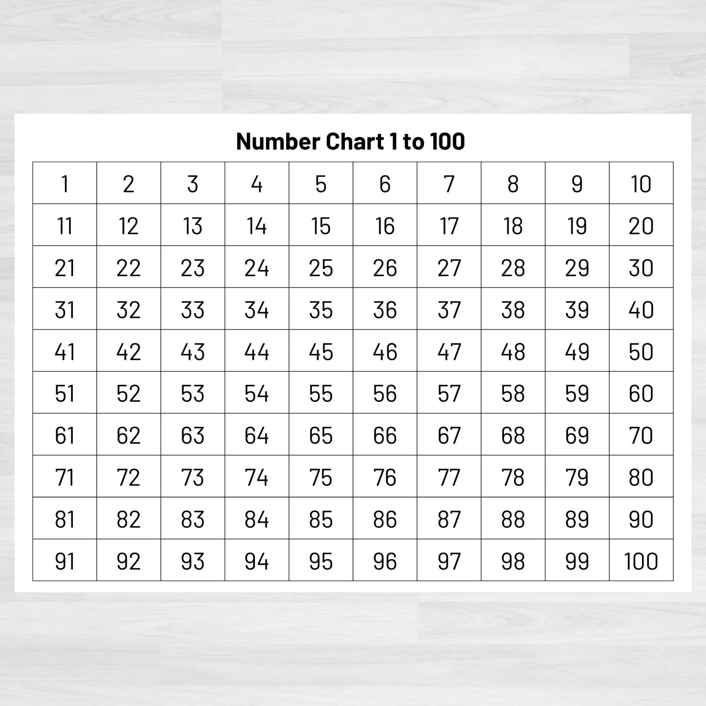

# Current Affairs

## STEP BY STEP APPROACH

### STEP 1: Identify Q's Types

* Open the <.docx> FILE in editing mode and mark each Question on the basis of their types.
* You can also convert <.docx> into <.pdf> for easily marking or colour coding the types for identification.



<table data-view="cards"><thead><tr><th></th><th></th><th></th></tr></thead><tbody><tr><td><p><strong>Type 1 (T1)</strong></p><p>Simple - Straightforward</p></td><td></td><td></td></tr><tr><td><p><strong>Type 2 (T2)</strong></p><p>Consider the following</p></td><td></td><td></td></tr><tr><td><p><strong>Type 3(T3)</strong></p><p>Match the Correct Pairs</p></td><td></td><td></td></tr></tbody></table>

<figure><figcaption></figcaption></figure>

### STEP 2: Arrange Qs in format: T1-> T2-> T3

#### Find all T2 Types and Take them towards the end of FILE

#### Find all T3 Types and Take them towards the end of FILE

At this Point, all our Questions are arranged in the T1-> T2-> T3 style but their Question Numbers are unordered and we need to fix this.

### STEP 3: Correct the Sequence of Question No. Markings

* Delete Old Unorganised Question Number Markings.
* ADD New Question Numbers starting from 1 to 100.


ATTENTION: If you find duplicate Questions or Missing Questions (All total must be 100) While arranging Questions and Adding New numbers, immediately report to the MANTAVYAM TEAM to get this fixed.


At this point, we've a properly arranged and ordered document which we'll use for our final edits.

### STEP 4: Find Answers and Cross Verify Them

* Highlighted Coloured Text in the Options is the Correct Answer to that particular Question.
* Record Answers to all Questions :

Create a Separate <.docx> or note down with a pen-paper or use the img below to mark on it.

<figure><figcaption></figcaption></figure>


DOWNLOAD 1-100 CHART IMAGE


#### CROSS VERIFICATION IN SPLIT SCREEN MODE


ATTENTION: Double Check and Cross Verify the Answers you've noted before updating in the Final Design. It is your responsibility and duty to avoid any errors in answer key. Students will learn from this and you must ensure it's correctness.


## LLM Instructions for MCQ Processing Workflow

````markdown
# Instructions for MCQ Processing Workflow

## OVERVIEW
You are tasked with processing current affairs MCQ documents following a strict editorial workflow. Your role is **FORMATTING ONLY** - do not alter any factual content or correct answers. Process English content only and remove all Hindi data completely.

## INPUT SPECIFICATIONS
- **File formats accepted:** Markdown (.md) or Word Document (.docx)
- **Language processing:** Extract and preserve ONLY English content, remove ALL Hindi data
- **Question count:** Should not be less than 100 else raise a flag and include in Processing Notes at the End(100+ is acceptable, no flagging required)
- **Answer detection:** Correct answers may be indicated by **bold text** OR highlighted text

## PROCESSING SEQUENCE

### TASK 1: QUESTION IDENTIFICATION & COUNTING

#### Step 1.1: Question Detection
1. **Search for all questions** using the pattern 'Q.' which indicates question start
2. **Extract complete question blocks** from 'Q.' until the next 'Q.' or end of document
3. **Increment question counter** for each 'Q.' found
4. **Output total question count** during processing: "Total Questions Found: [X]"

#### Step 1.2: Question Extraction Rules
- **Include everything** from 'Q.' until next question or document end
- **Capture all options** associated with each question
- **Preserve answer markings** (bold or highlighted text)
- **Include any explanatory content** for later removal

### TASK 2: QUESTION TYPE CLASSIFICATION

#### Step 2.1: Type Identification Sequence
Process in this exact order: **T1 → T2 → T3**

#### TYPE 1 (T1) - Simple/Straightforward Questions
**Recognition Patterns:**
- Direct factual questions without complex structures
- Does NOT contain "consider the following" or "read the following statements"
- Does NOT contain matching/pairing instructions
- Single question stem followed by options

**Example Pattern:**
```
Q. Which organization signed the MoU?
A) Option 1
B) Option 2 
C) Option 3
D) **Option 4**
```

#### TYPE 2 (T2) - Statement Consideration Questions
**Recognition Patterns:**
- Contains phrases: "Read the following statements", "Consider the following", "Which of the following statements"
- Multiple numbered statements (i, ii, iii, iv, v, etc.)
- Options combine statement numbers (e.g., "i, ii, and iii only")

**Example Pattern:**
```
Q. Read the following statements about XYZ:
i) Statement one
ii) Statement two  
iii) Statement three
a) i and ii only
b) **ii and iii only**
```

#### TYPE 3 (T3) - Matching/Pairing Questions
**Recognition Patterns:**
- Contains "match the correct pairs", "matched correctly", "which pair is correct"
- Presents data in table format or A-B-C pairing structure  
- Options refer to pair combinations (e.g., "Both A and B", "All A, B, C")

**Example Pattern:**
```
Q. Which pairs are correctly matched?
A. Item 1 - Description 1
B. Item 2 - Description 2
C. Item 3 - Description 3
Options: Both A and B, **Both B and C**, etc.
```

### TASK 3: DATA FORMATTING FOR ALL QUESTION TYPES

#### Step 3.1: Hindi Data Removal
1. **Identify Hindi text** (Devanagari script or Hindi transliteration in parentheses)
2. **Remove completely** all Hindi content including:
   - Hindi translations in parentheses: (हिंदी टेक्स्ट)
   - Standalone Hindi sentences or phrases
   - Mixed Hindi-English sentences - keep only English parts
3. **Clean up spacing** after Hindi removal to avoid double spaces or formatting issues

#### Step 3.2: Explanatory Data Removal  
1. **Identify explanatory content** that appears after MCQ options:
   - Bullet point explanations
   - Paragraph explanations  
   - Additional context or background information
   - Reference material or source citations
2. **Remove all explanatory content** - keep only question stem and options
3. **Preserve answer markings** during explanatory content removal

#### Step 3.3: Option Formatting Standardization
1. **Remove existing option indicators:** A), a), (a), (A), etc.
2. **Apply standard alphabetical sequence:** A, B, C, D, E... (capital letters)
3. **Format as:** 
   ```
   A. [Option text]
   B. [Option text]  
   C. [Option text]
   D. [Option text]
   ```
4. **Maintain answer markings** on correct options using **bold formatting**

### TASK 4: QUESTION NUMBERING

#### Step 4.1: Sequential Numbering
1. **Remove all existing question numbers**
2. **Apply new sequential numbering** starting from 1
3. **Format as:** "**Q1.** [question content]", "**Q2.** [question content]", etc.
4. **Continue numbering** regardless of total count (no 100-question limit)

### TASK 5: ANSWER KEY GENERATION

#### Step 5.1: Answer Detection Protocol
**Primary Method:** Look for **bold formatted options**
**Secondary Method:** Look for highlighted/colored options (if detectable)

#### Step 5.2: Answer Table Creation
Create a two-column table:

| S. No. | Correct Option Alphabet |
|--------|------------------------|
| 1      | A                      |
| 2      | C                      |
| 3      | X                      |
| ...    | ...                    |

**Rules:**
- **S. No.** corresponds to question number (Q1 = 1, Q2 = 2, etc.)
- **Correct Option Alphabet** is the letter (A, B, C, D, etc.) of the correct answer
- **Use 'X'** if no clear answer marking is found for a question

### TASK 6: DUAL VERIFICATION PROCESS

#### Step 6.1: Top-Down Verification
1. **Compare processed output** with original source document
2. **Verify question content** remains factually identical (English portions only)
3. **Check answer key accuracy** against original markings
4. **Confirm no content alteration** beyond formatting changes

#### Step 6.2: Bottom-Up Verification  
1. **Reverse-check each processed question** against source
2. **Validate option content** matches original English text
3. **Cross-reference answer markings** with original bold/highlighted indicators
4. **Document any discrepancies** for manual review

#### Step 6.3: Verification Report
Generate brief report:
```
VERIFICATION SUMMARY:
- Total Questions Processed: [X]
- Questions with Clear Answers: [Y]  
- Questions with Unclear Answers (marked X): [Z]
- Content Alterations: None (formatting only)
- Hindi Data Removed: Yes
- Explanatory Data Removed: Yes
```

### TASK 7: FINAL MARKDOWN OUTPUT

#### Step 7.1: Document Structure
```markdown
# Current Affairs MCQ - Processed Document

**Total Questions:** [X]

## Questions

**Q1.** [Question content]
A. [Option]
B. [Option]  
C. **[Correct Option]**
D. [Option]

**Q2.** [Question content]
A. [Option]
B. **[Correct Option]**
C. [Option]
D. [Option]

[Continue for all questions...]

## UNCLEAR (if any)

## Answer Key

| S. No. | Correct Option Alphabet |
|--------|------------------------|
| 1      | C                      |
| 2      | B                      |
| 3      | X                      |
| ...    | ...                    |

## Processing Notes
- Hindi content removed completely
- Explanatory data removed  
- Options reformatted to A, B, C, D sequence
- Answer markings preserved from original bold/highlighted text
```

## CRITICAL PROCESSING RULES

### Absolute Requirements:
1. **PRESERVE factual accuracy** - only format, never alter content meaning
2. **REMOVE all Hindi data** completely and systematically  
3. **DETECT answers** from bold OR highlighted text (whichever is available)
4. **MAINTAIN original English content** exactly as written
5. **REMOVE explanatory content** while preserving core question and options
6. **STANDARDIZE option formatting** to alphabetical sequence
7. **OUTPUT in markdown format** only

### Error Handling:
- **Unclear question type:** Append in a Last Section (Call It UNCLEAR), continue processing
- **No answer detected:** Mark as 'X' in answer key, continue processing
- **Multiple answer markings:** Use first detected marking, flag in notes
- **Incomplete questions:** Process as-is, note in verification report
````

#### WATCH VIDEO GUIDE


